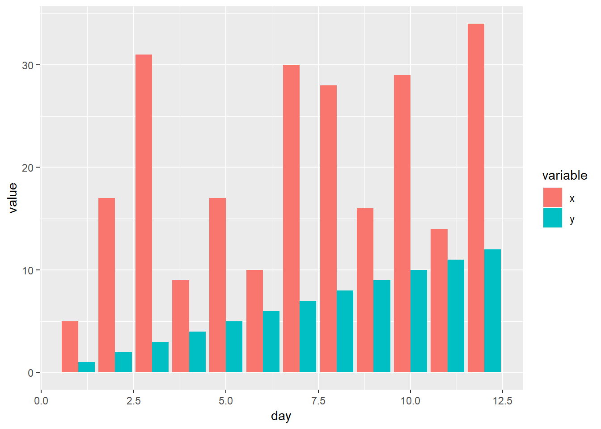
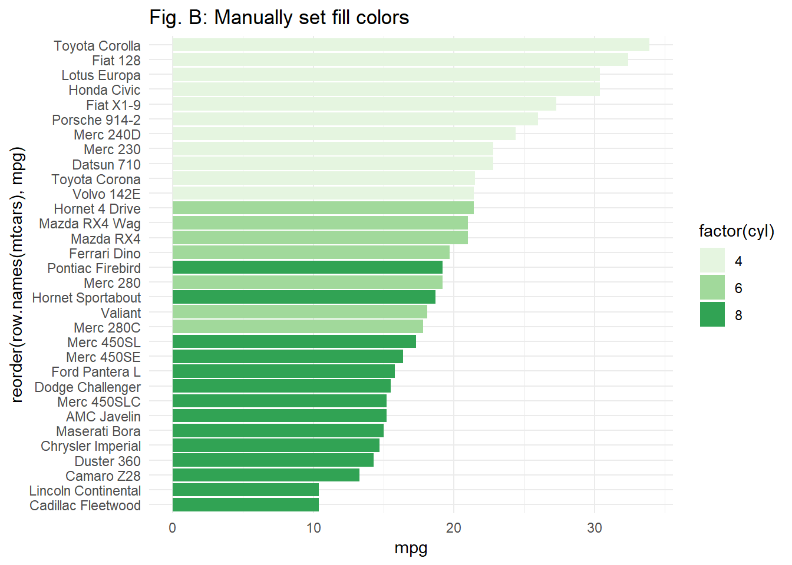
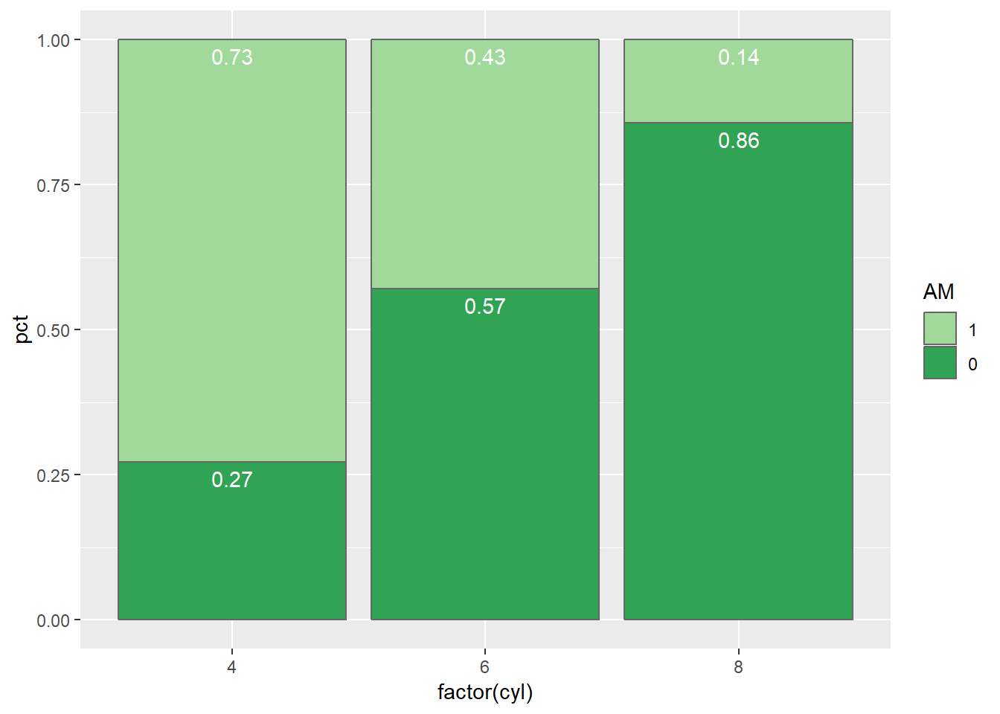
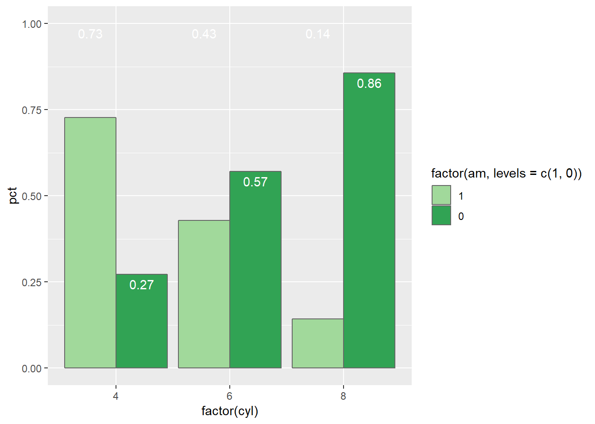
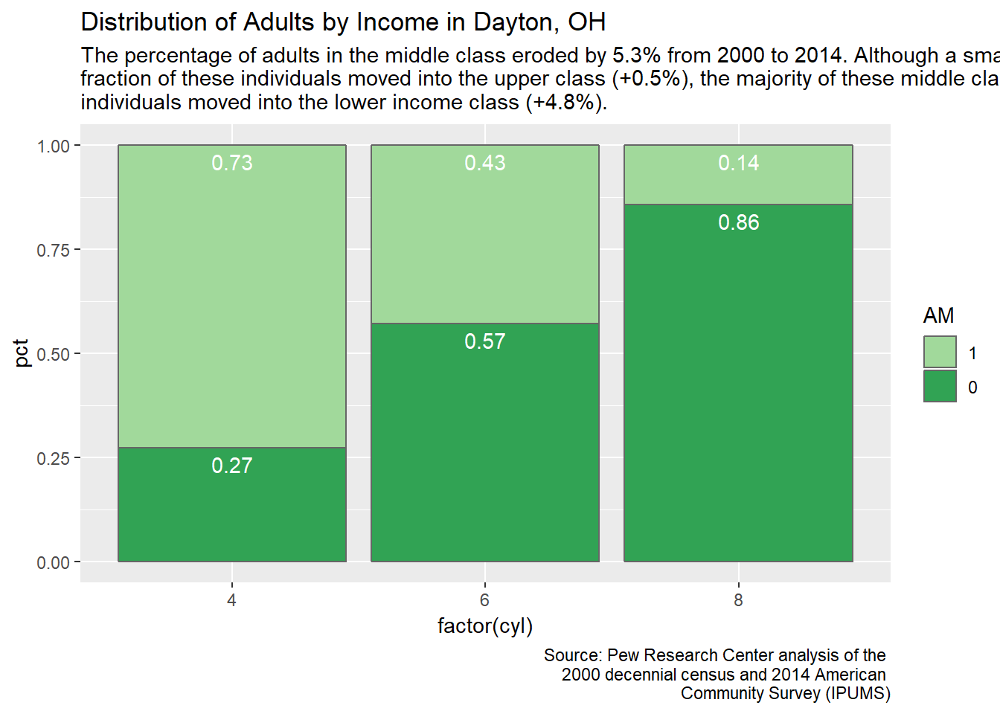
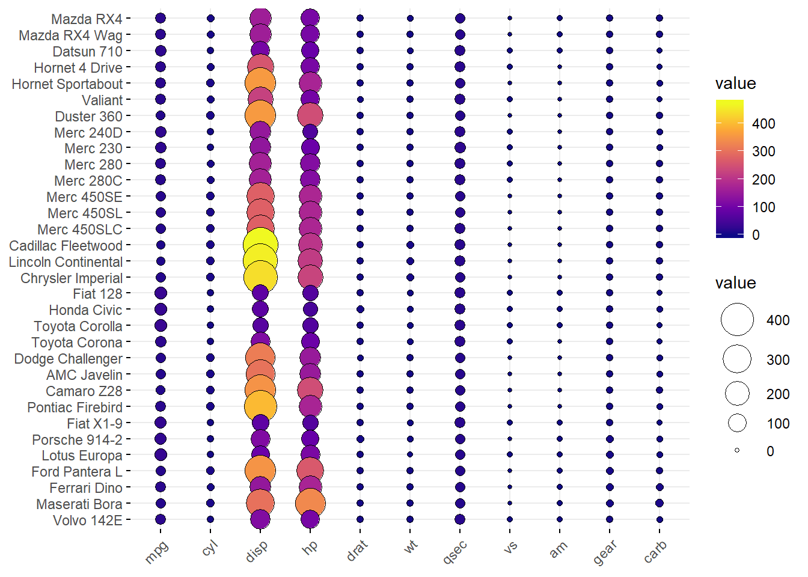
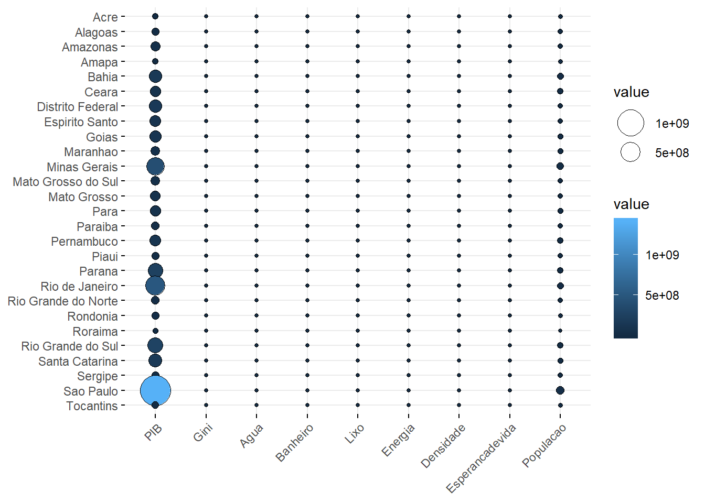

#Barras com duas variáveis {#Barras2VAR}


Para que serve: O gráfico de barras é uma maneira de resumir a informação de duas ou mais variáveis qualitativas. 


```r
par(bg="#fdf6e3")
load(url("https://raw.githubusercontent.com/DATAUNIRIO/Base_de_dados/master/Titanic.RData"))
#legenda
nomes = levels(Titanic$Classe)
nomes
```

```
## [1] "Tripulação" "Primeira"   "Segunda"    "Terceira"
```

```r
# percentual da linha ou da coluna
#porcent = prop.table(bartable)*100   # percentual do total
#porcentlinha = prop.table(bartable,1)*100 # percentual da linha
#porcentcoluna = prop.table(bartable,1)*100 # percentual da coluna
bartable = table(Titanic$Classe, Titanic$Sobreviveu)  ## get the cross tab
porcentlinha = round(prop.table(bartable,1)*100,1) # percentual da linha arrendondada para uma casa decimal
# Método simples
rotulo=paste(porcentlinha)
barras<-barplot(bartable, beside = TRUE, legend = levels(unique(Titanic$Classe)),col=c("black","skyblue","royalblue","darkblue"))  ## plot 
text(barras, 0, rotulo,cex=1,pos=3, col ="#ffffff")
```


```r
par(bg="#fdf6e3") 
# Customização
rotulo2=paste(nomes,"\n (",porcentlinha,"%",")",sep="")

barras2<-barplot(bartable, beside = TRUE, legend = levels(unique(Titanic$Classe)),col=c("black","skyblue","royalblue","darkblue"))  ## plot 
text(barras2, 2, rotulo2,cex=0.8,pos=4, srt=90,col ="#ffffff")
```


```r
barras3<-barplot(bartable, legend = levels(unique(Titanic$Classe)),col=c("black","skyblue","royalblue","darkblue"))
```


## Barras no ggplot2


```r
library(ggplot2)
library(reshape2)

x <- c(5,17,31,9,17,10,30,28,16,29,14,34)
y <- c(1,2,3,4,5,6,7,8,9,10,11,12)
day <- c(1,2,3,4,5,6,7,8,9,10,11,12)

df1 <- data.frame(x, y, day)
df2 <- melt(df1, id.vars='day')

ggplot(df2, aes(x=day, y=value, fill=variable)) +
    geom_bar(stat='identity', position='dodge')
```



## Barras "lado a lado" no ggplot2


```r
library("ggplot2")
library("reshape")
  x <- c(5,17,31,9,17,10,30,28,16,29,14,34)
  y <- c(1,2,3,4,5,6,7,8,9,10,11,12)
  day <- c(1,2,3,4,5,6,7,8,9,10,11,12)
  df1 <- data.frame(x,y,day)
  df2 <- reshape::melt(df1, id = c("day"))
  ggplot(data = df2, aes(x = day, y = value, fill = variable)) +
    geom_bar(stat = "identity")+ facet_wrap(~ variable) +
    scale_x_continuous(breaks=seq(1,12,2))
```


```r
library("ggplot2")
library("reshape")
  x <- c(5,17,31,9,17,10,30,28,16,29,14,34)
  y <- c(1,2,3,4,5,6,7,8,9,10,11,12)
  day <- c(1,2,3,4,5,6,7,8,9,10,11,12)
  df1 <- data.frame(x,y,day)
  df2 <- reshape::melt(df1, id = c("day"))
 ggplot(data = df2, aes(x = day, y = value, fill = day)) +
   geom_bar(stat = "identity") + 
   facet_wrap(~ variable) +
   scale_x_continuous(breaks=seq(1,12,2))
```


```r
library(dplyr)
avg_mpg <- mtcars %>%
        group_by(cyl, am) %>%
        summarise(mpg = mean(mpg, na.rm = TRUE))

p1 <- ggplot(avg_mpg, aes(factor(cyl), mpg, fill = factor(am))) +
        geom_bar(stat = "identity", position = "dodge") +
        ggtitle("Default color comparison")
```


```r
library(dplyr)
avg_mpg <- mtcars %>%
        group_by(cyl, am) %>%
        summarise(mpg = mean(mpg, na.rm = TRUE))

# more pleasing colors
p2 <- ggplot(avg_mpg, aes(factor(cyl), mpg, fill = factor(am))) +
        geom_bar(stat = "identity", position = "dodge", color = "grey40") +
        scale_fill_brewer(palette = "Pastel1") +
        ggtitle("Adjusted color comparison")
grid.arrange(p1, p2, ncol = 2)
```


```r
library(dplyr)
avg_mpg <- mtcars %>%
        group_by(cyl, am) %>%
        summarise(mpg = mean(mpg, na.rm = TRUE))

p3 <- ggplot(avg_mpg, aes(factor(cyl), mpg, fill = factor(am))) +
        geom_bar(stat = "identity")
p3
```


  

```r
p1 <- ggplot(mtcars, aes(reorder(row.names(mtcars), mpg), mpg)) +
        geom_bar(stat = "identity") +
        coord_flip() +
        geom_text(aes(label = mpg), nudge_y = 2)

p2 <- ggplot(mtcars, aes(reorder(row.names(mtcars), mpg), mpg)) +
        geom_bar(stat = "identity") +
        coord_flip() +
        geom_text(aes(label = mpg), nudge_y = -2, color = "white")

grid.arrange(p1, p2, ncol = 2)
```


```r
p1 <- ggplot(avg_mpg, aes(factor(cyl), mpg, fill = factor(am))) +
        geom_bar(stat = "identity", position = "dodge") +
        geom_text(aes(label = round(mpg, 1)), position = position_dodge(0.9)) +
        ggtitle("Fig A: Default text alignment")

p2 <- ggplot(avg_mpg, aes(factor(cyl), mpg, fill = factor(am))) +
        geom_bar(stat = "identity", position = "dodge") +
        geom_text(aes(label = round(mpg, 1)), position = position_dodge(0.9),
                  vjust = 1.5, color = "white") +
        ggtitle("Fig B: Adjusted text alignment")

grid.arrange(p1, p2, ncol = 2)
```


```r
# compare mpg across all cars and color based on cyl
p1 <- ggplot(mtcars, aes(x = reorder(row.names(mtcars), mpg), y = mpg, fill = factor(cyl))) +
        geom_bar(stat = "identity") +
        coord_flip() +
        theme_minimal() +
        ggtitle("Fig. A: Default fill colors")
p1
```


```r
p2 <- ggplot(mtcars, aes(x = reorder(row.names(mtcars), mpg), y = mpg, fill = factor(cyl))) +
        scale_fill_manual(values = c("#e5f5e0", "#a1d99b", "#31a354")) +
        geom_bar(stat = "identity") +
        coord_flip() +
        theme_minimal() +
        ggtitle("Fig. B: Manually set fill colors")

p2
```




## create label location for each proportional bar

```r
# create label location for each proportional bar

proportion <- mtcars %>%
        group_by(cyl, am) %>%
        tally() %>%
        group_by(cyl) %>%
        mutate(pct = n / sum(n))

proportion <- proportion %>%
        group_by(cyl) %>%
        mutate(label_y = cumsum(pct))

p1 <- ggplot(proportion, aes(factor(cyl), pct, fill = factor(am, levels = c(1, 0)))) +
        geom_bar(stat = "identity", color = "grey40") +
        geom_text(aes(label = round(pct, 2), y = label_y), vjust = 1.5, color = "white") +
        scale_fill_manual(values = c("#a1d99b", "#31a354")) +
        labs(fill = "AM")
p1
```



```r
p2 <- ggplot(proportion, aes(factor(cyl), pct, fill = factor(am, levels = c(1, 0)))) +
        geom_bar(stat = "identity", position = "dodge", color = "grey40") +
        scale_fill_manual(values = c("#a1d99b", "#31a354")) +
        geom_text(aes(label = round(pct, 2), y = label_y), position = position_dodge(0.9),
                 vjust = 1.5, color = "white", family = "Georgia")
p2
```




```r
p1+ labs(title = "Distribution of Adults by Income in Dayton, OH",
             subtitle = "The percentage of adults in the middle class eroded by 5.3% from 2000 to 2014. Although a small \nfraction of these individuals moved into the upper class (+0.5%), the majority of these middle class \nindividuals moved into the lower income class (+4.8%).",
             caption = "Source: Pew Research Center analysis of the \n2000 decennial census and 2014 American \nCommunity Survey (IPUMS)")
```


## Alternativas ao Gráfico de Barras

## MOSAICO

Descrição.  Conjunto de retângulo, cada um representa o cruzamento de dois níveis de duas variáveis e o tamanho de cada retângulo é proporcional ao percentual de observações dessa combinação de níveis de variáveis.


```r
# Gráfico de Mosaico ou Mosaicplot
library(RColorBrewer)
par(bg="#fdf6e3") 
#display.brewer.all()
COR<-brewer.pal(4,"Dark2")
#COR

# Gráfico de Mosaico ou Mosaicplot
mosaico<-mosaicplot(bartable,col=COR)
```


## Balloon plot

Balloon plot is an alternative to bar plot for visualizing a large categorical data. We’ll use the function ggballoonplot() [in ggpubr], which draws a graphical matrix of a contingency table, where each cell contains a dot whose size reflects the relative magnitude of the corresponding component. 


```r
par(bg="#fdf6e3") 
library(ggplot2)
library(ggpubr)
theme_set(theme_pubr())

data("mtcars")
ggballoonplot(mtcars, fill = "value")
```


```r
COR <- c("#0D0887FF", "#6A00A8FF", "#B12A90FF","#E16462FF", "#FCA636FF", "#F0F921FF")
ggballoonplot(mtcars, fill = "value")+
  scale_fill_gradientn(colors = COR)
```



```r
library(RCurl)
x <- getURL("https://raw.githubusercontent.com/DATAUNIRIO/Base_de_dados/master/Estados.csv")
BaseUF <- read.csv(text=x, header=T, quote="", sep=";",dec = ",")
row.names(BaseUF)<-BaseUF$Estado
BaseUF<-BaseUF[,c(7:15)]
ggballoonplot(BaseUF, fill = "value")
```




Correspondence analysis

Correspondence analysis can be used to summarize and visualize the information contained in a large contingency table formed by two categorical variables.

Required package: FactoMineR for the analysis and factoextra for the visualization


```r
library(FactoMineR)
library(factoextra)
dt=mtcars[,c(1:7,10)]
res.ca <- CA(dt, graph = FALSE)
fviz_ca_biplot(res.ca, repel = TRUE)
```


