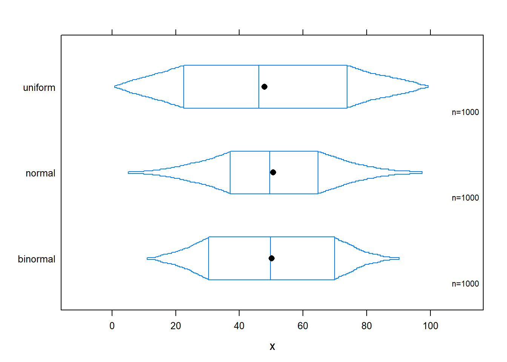
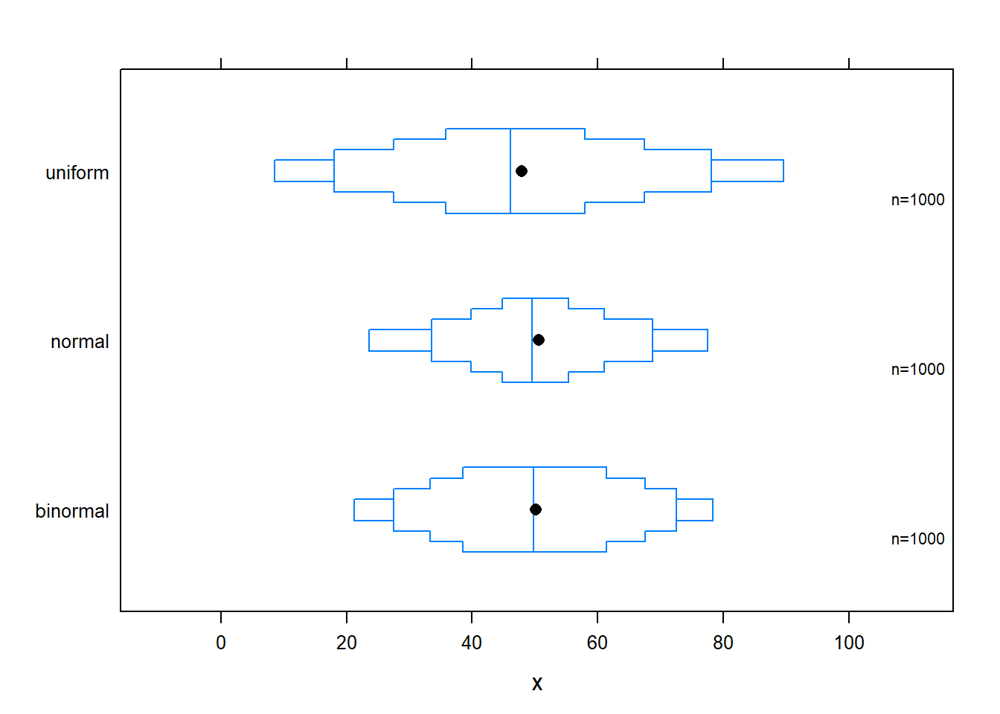

#Boxplot {#Boxplot}


Definição: uma  uma representação gráfica em formato de retângulos cuja área é proporcional à frequência de uma variável quantitativa e cuja largura é igual ao intervalo de classe.

Para que serve: Um histograma é uma representação gráfica da distribuição de uma variável quantitativa contínua. Com o histograma pode-se visualizar a dispersão/concentração dos dados, bem como a assimetria/simetria dos dados. É muito utilizado para visualizar toda a distribuição de uma variável quantitativa. Foi introduzida pela primeira vez por Karl Pearson (OBS - É muito parecido com o gráfico de barras).


## Boxplot no ggplot2


```r
par(bg="#fdf6e3") 
# using ggplot2:
var <- rnorm(1000, 50,10)
group <- c(rep("A",100), rep("B",100), rep("C",100), rep("D",100), rep("E", 100))
dataf <- data.frame(var, group)

require(ggplot2)
plot2 <- ggplot (dataf, aes (y = var, x= group, fill = group ))
plot2 + geom_boxplot()+theme_bw( )
```


## Alternativas ao Boxplot

## Trellis plot in Box-Percentile Panel Decile plot


```r
x <- c(rnorm(1000, 50, 20), rnorm(500, 70, 10), rnorm(500, 30, 10), runif(1000, 0, 100))
g <- rep (c("normal", "binormal", "uniform"), each = 1000)
# default trellis box plot
require(lattice)
require(Hmisc)
#regular box plot  
bwplot(g ~ x, col = "red", fill = c("cyan4", "tan", "blue"))
```


```r
# box-percentile plot with data density (rug plot)
bwplot(g ~ x, panel=panel.bpplot, probs=seq(.01,.49,by=.01), datadensity=TRUE,
col = "red" )
```


```r
# continuous plot up until quartiles ("Tootsie Roll plot")
bwplot(g ~ x, panel=panel.bpplot, probs=seq(.01,.25,by=.01))
```



```r
# same as previous but add a spike to give 0.95 interval
bwplot(g ~ x, panel=panel.bpplot, probs=c(.025,seq(.25,.49,by=.01)))
```


## Decile plot


```r
# decile plot with reference lines at outer quintiles and median
bwplot(g ~ x, panel=panel.bpplot, probs=c(.1,.2,.3,.4), qref=c(.5,.2,.8))
```




## Back 

```r
#Box-percentile plots
normal <- rnorm(10000, 7.5,3)
binormal <- c(rnorm(5000, 3, 2.5), rnorm(5000, 5, 2.5))
uniform <- runif (10000, -5, 17)

require(Hmisc)
bpplot(normal, binormal, uniform)
```


```r
#beanplot
# data 
set.seed(1234)
 bimodal <- c(rnorm(250, -2, 0.6), rnorm(250, 2, 0.6))
uniform <- runif(500, -4, 4)
 normal <- rnorm(500, 0, 1.5)
 ylim <- c(-7, 7)
```


```r
# plot 
library("beanplot")
beanplot(bimodal, uniform, normal, ylim = ylim, main = "beanplot",col = c("cyan3", "purple", "purple"), border = "cyan3")
```


```r
 # col - these colors stand for the area of the beans (without the border, use border for that color), the lines # inside the bean, the lines outside the bean, and the average line per bean
```


## Notched boxplot

```r
# data 
x <- c(rnorm(1000, 50, 20), rnorm(500, 70, 10), rnorm(500, 30, 10), runif(1000, 0, 100))
g <- rep (c("normal", "binormal", "uniform"), each = 1000)

#plot 
boxplot(x, col = c("bisque"), notch = TRUE)
```


```r
boxplot(x ~ g, col = c("bisque", "cyan4", "yellow"), notch = TRUE)
```


```r
# layout boxplot is at the bottom 
data <- rnorm(100)
nf <- layout(mat = matrix(c(1,2),2,1, byrow=TRUE),  height = c(3,1))
par(mar=c(3.1, 3.1, 1.1, 2.1))
hist(data,xlim=c(-4,4), col = "pink")
boxplot(data, horizontal=TRUE,  outline=TRUE,ylim=c(-4,4), frame=F, col = "green1", width = 10)
```


