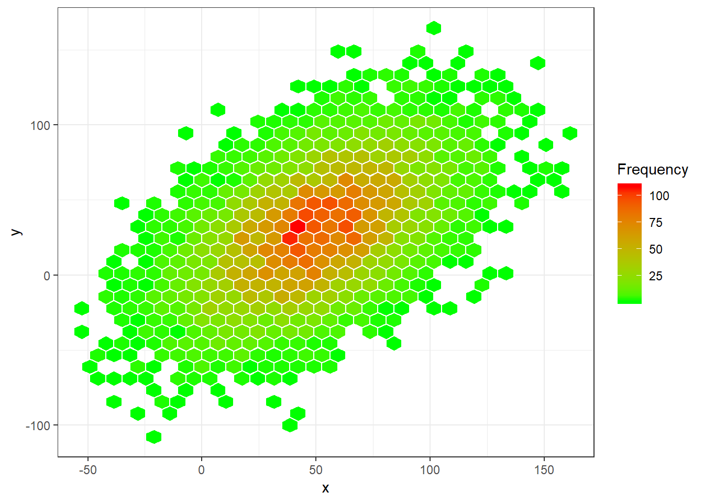

#Hexabinscatterplot {#Hexabinscatterplot}


## Hexabin XY scatter plot and transparent point XY plot R Markdown


```r
# data
set.seed(1234)
x = rnorm(10000, 50, 30)
y = x*0.6 + rnorm (10000, 0, 30)
df <- data.frame(x,y)
library(ggplot2)
ggplot(df,aes(x=x,y=y)) + stat_binhex() + theme_bw()
```


```r
# vivid colored 
ggplot(df,aes(x=x,y=y)) + stat_binhex(colour="white",na.rm=TRUE) + scale_fill_gradientn(colours=c("green1","red"),name = "Frequency",na.value=NA)+ theme_bw()
```



```r
# plot with transparency 

ggplot(df,aes(x=x,y=y)) + geom_point(alpha = 0.3, col = "red") + theme_bw()
```


```r
# in base
# data
set.seed(1234)
x = rnorm(10000, 50, 30)
y = x*0.6 + rnorm (10000, 0, 30)
df <- data.frame(x,y)
plot(df$x, df$y, pch = 19, cex = 1, col = rgb(0,1,0, alpha = 0.1))
```


```r
# alpha function to introduce transparency
require(RColorBrewer)
```

```
## Carregando pacotes exigidos: RColorBrewer
```

```r
add.alpha <- function(col, alpha=1){
  if(missing(col))
    stop("vector of colours missing")
  apply(sapply(col, col2rgb)/255, 2, 
                     function(x) 
                       rgb(x[1], x[2], x[3], alpha=alpha)) 
}
# POINT SIZE AND TRANSPARENCY 
plot(df$x, df$y, pch = 19, cex = 0.5, col = add.alpha ("red", 0.2))
```


```r
set.seed (1234)
Xv <- c(rnorm (500, 10,3), rnorm (500, 50, 20), rnorm (500, 70, 20))
Yv <- c(rnorm (500, 10,3), rnorm (500, 70, 5), rnorm (500, 30, 5))
myd <- data.frame (Xv, Yv )

m <- ggplot(myd, aes(x = Xv, y = Yv)) +
  geom_point() + geom_density2d() + theme_bw()
```

