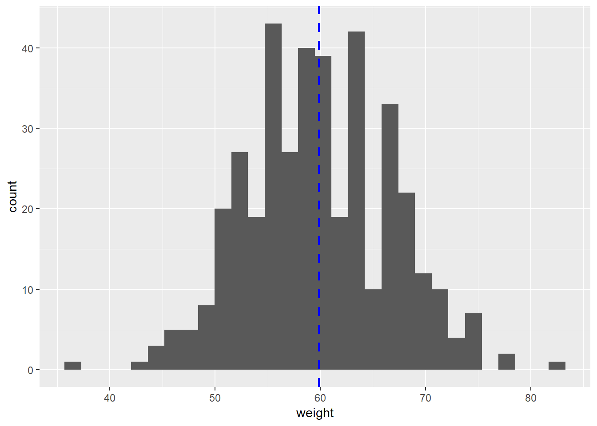
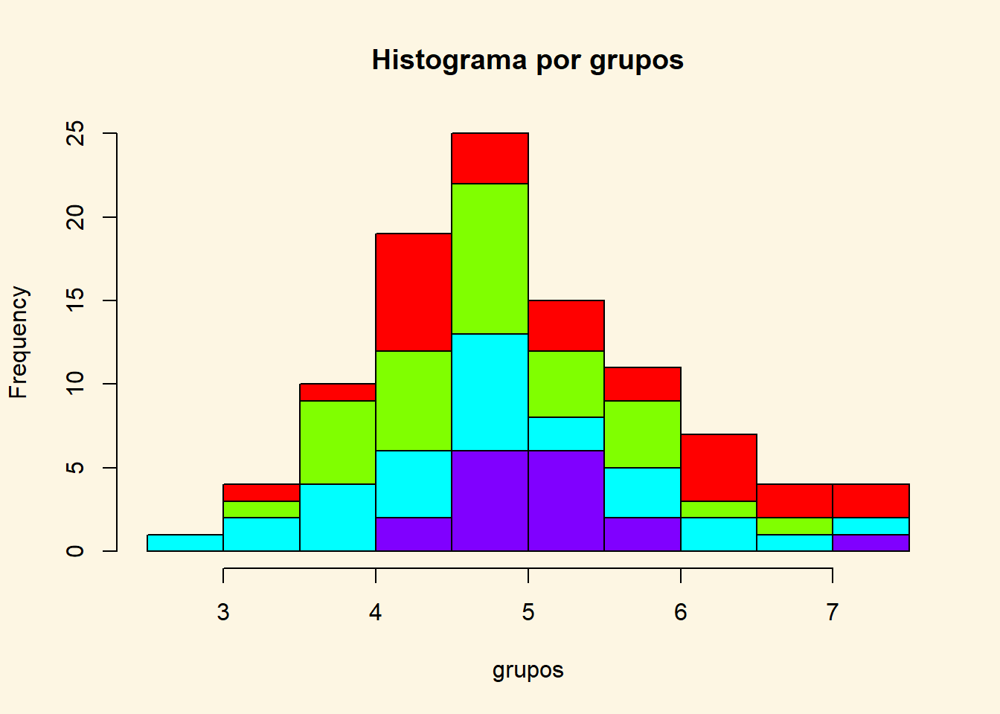

#Histograma {#Histograma}


Definição: uma  uma representação gráfica em formato de retângulos cuja área é proporcional à frequência de uma variável quantitativa e cuja largura é igual ao intervalo de classe.

Para que serve: Um histograma é uma representação gráfica da distribuição de uma variável quantitativa contínua. Com o histograma pode-se visualizar a dispersão/concentração dos dados, bem como a assimetria/simetria dos dados. É muito utilizado para visualizar toda a distribuição de uma variável quantitativa. Foi introduzida pela primeira vez por Karl Pearson (OBS - É muito parecido com o gráfico de barras).


```r
par(bg="#fdf6e3") 
data(mtcars)
hist(mtcars$mpg,col="steelblue")
```


## Histograma

```r
library(RColorBrewer)
par(bg="#fdf6e3") 
#display.brewer.all()
COR<-brewer.pal(5,"Blues")

#COR
hist(mtcars$mpg,col=COR,main="Histograma do MPG",xlab = "Milhas por Galão - MPG", ylab = "Frequência")
```


```r
COR<-brewer.pal(5,"YlGn")
hist(mtcars$mpg,col=COR, scale="percent",main="Histograma do MPG",xlab = "Milhas por Galão - MPG", ylab = "Percentual")
```


## Histograma no ggplot2


```r
par(bg="#fdf6e3") 
library(ggplot2)
ggplot(mtcars, aes(mpg)) +
  geom_histogram()
```


```r
# Change color
ggplot(mtcars, aes(mpg)) +
  geom_histogram(color="#45ad8a", fill="#417f6a")
```


## Modificação do Histograma no ggplot2


```r
par(bg="#fdf6e3") 
library(ggplot2)
ggplot(mtcars, aes(y =..density..,mpg, fill = factor(am)))+
  geom_histogram(binwidth = 1.5)
```


```r
ggplot(mtcars, aes(y =..density..,mpg, fill = factor(am)))+
  geom_histogram(binwidth = 1.5)+
  geom_density(alpha = .1) 
```


## Histograma Avançado no ggplot2


```r
par(bg="#fdf6e3") 
df <- data.frame(
  sex=factor(rep(c("F", "M"), each=200)),
  weight=round(c(rnorm(200, mean=55, sd=5), rnorm(200, mean=65, sd=5)))
  )
head(df)
```

```
##   sex weight
## 1   F     48
## 2   F     57
## 3   F     56
## 4   F     52
## 5   F     52
## 6   F     59
```

```r
library(ggplot2)
p<-ggplot(df, aes(x=weight)) + 
  geom_histogram()
# Add mean line
p+ geom_vline(aes(xintercept=mean(weight)),
            color="blue", linetype="dashed", size=1)
```



```r
ggplot(df, aes(x=weight, fill =sex, color=sex)) +
  geom_histogram(alpha=0.8, position="identity")
```


```r
# Change line colors by groups
ggplot(df, aes(x=weight, fill =sex, color=sex)) +
  geom_histogram(alpha=0.8, position="identity")+
  scale_color_manual(values=c("#999999", "#E69F00", "#56B4E9"))+
  scale_fill_manual(values=c("#999999", "#E69F00", "#56B4E9"))+
  labs(title="Histograma no ggplot2",x="Peso(kg)", y = "Contagem")+
  theme_classic()
```


## Alternativas ao Histograma

## Histograma por grupos 'Stack'


```r
par(bg="#fdf6e3") 
library(plotrix)
df<-data.frame(len=rnorm(100)+5,
   grp=sample(c("A","B","C","D"),100,replace=TRUE))
  histStack(len~grp,data=df,main="Histograma por grupos",
   xlab="grupos")
```




## Back to back histogramas


```r
#Back to back histograms
# data
var1<- rnorm(1000,10,3)
var2 <- sample(c('A','B'),1000,TRUE)
#plot
 require(Hmisc)
 out <- histbackback(split(var1, var2), probability=TRUE, xlim=c(-.18,.18), main ='Back to Back Histogram')
```


