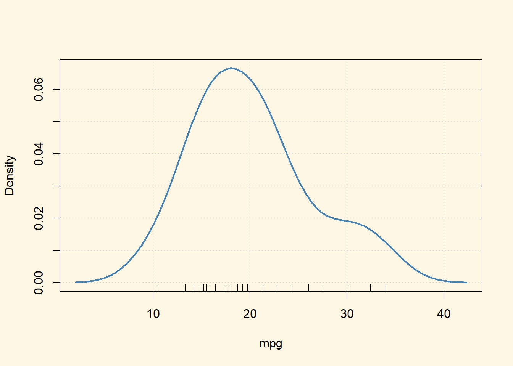
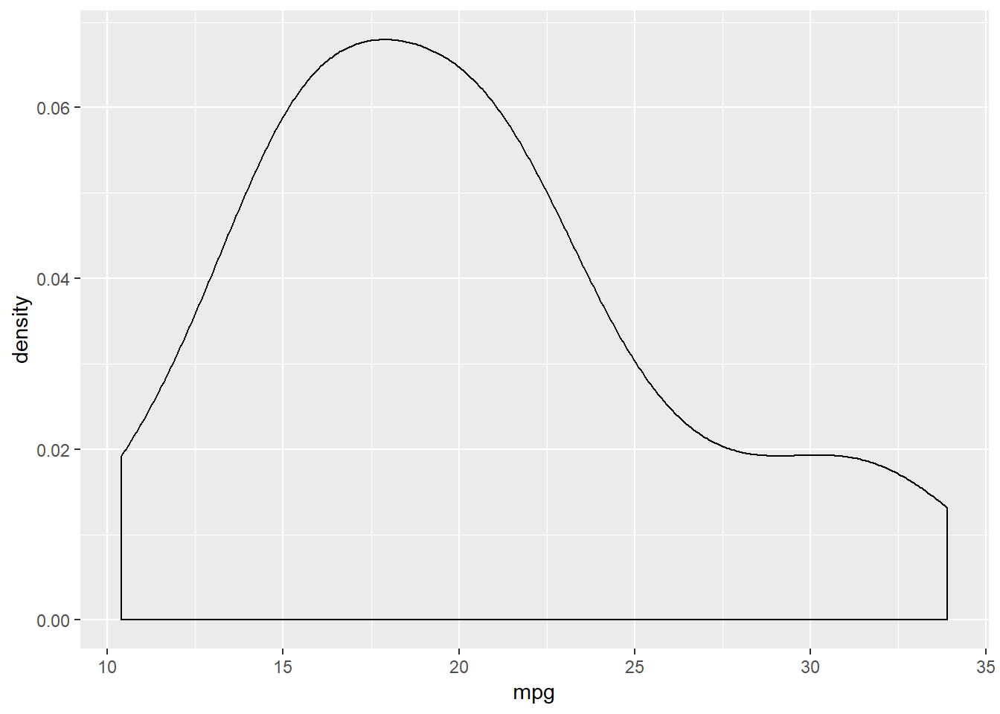
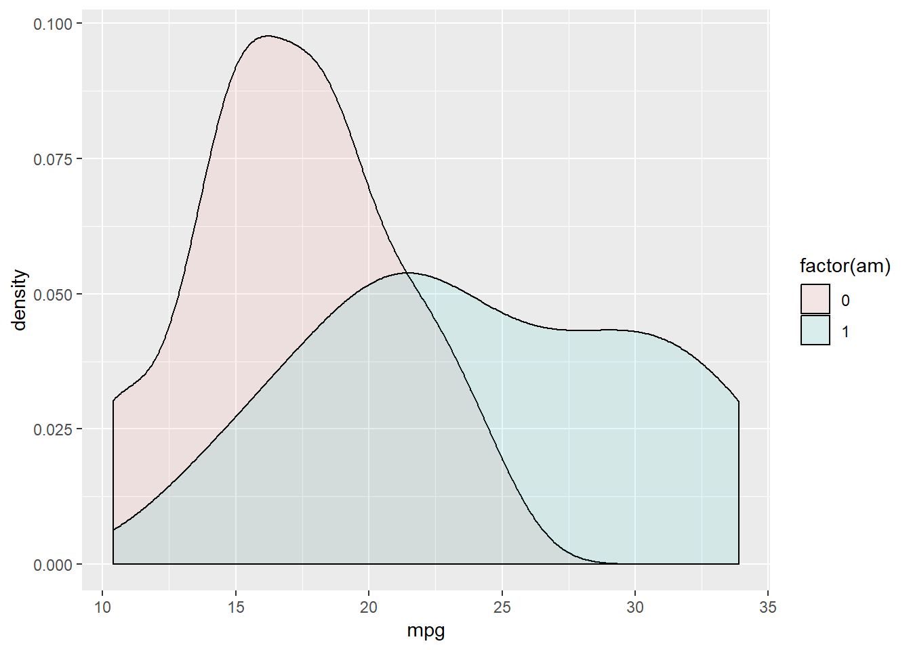

#Densidade {#Densidade}


Definição: 

Para que serve: 


```r
par(bg="#fdf6e3") 
require(car)
data(mtcars)
densityPlot( ~ mpg, data=mtcars, adjust=1, method="kernel",col="steelblue")
```



## Densidade

```r
require(car)
mtcars <- within(mtcars, {
  am <- as.factor(am)
  vs <- as.factor(vs)
})
par(bg="#fdf6e3") 
densityPlot(mpg~am, data=mtcars,  adjust=1, method="kernel",col=c("steelblue","red"))
```


## Gráfico de densidade no ggplot2


```r
par(bg="#fdf6e3") 
library(ggplot2)
ggplot(mtcars, aes(mpg)) +
  geom_density()
```



```r
# Change color
ggplot(mtcars, aes(mpg)) +
  geom_density(color="#45ad8a", fill="#417f6a")
```


## Modificação do gráfico no ggplot2


```r
par(bg="#fdf6e3") 
library(ggplot2)
ggplot(mtcars, aes(y =..density..,mpg, fill = factor(am)))+
  geom_density()
```


```r
ggplot(mtcars, aes(y =..density..,mpg, fill = factor(am)))+
  geom_density(alpha = .1) 
```



```r
df <- data.frame(
  sex=factor(rep(c("F", "M"), each=200)),
  weight=round(c(rnorm(200, mean=55, sd=5), rnorm(200, mean=65, sd=5)))
  )
#######################################
p<-ggplot(df, aes(x=weight)) + 
  geom_density()
# Add mean line
# Change line colors by groups
ggplot(df, aes(x=weight, fill =sex, color=sex)) +
  geom_density(alpha=0.8, position="identity")+
  scale_color_manual(values=c("#999999", "#E69F00", "#56B4E9"))+
  scale_fill_manual(values=c("#999999", "#E69F00", "#56B4E9"))+
  labs(title="Histograma no ggplot2",x="Peso(kg)", y = "Contagem")+
  theme_classic()
```


