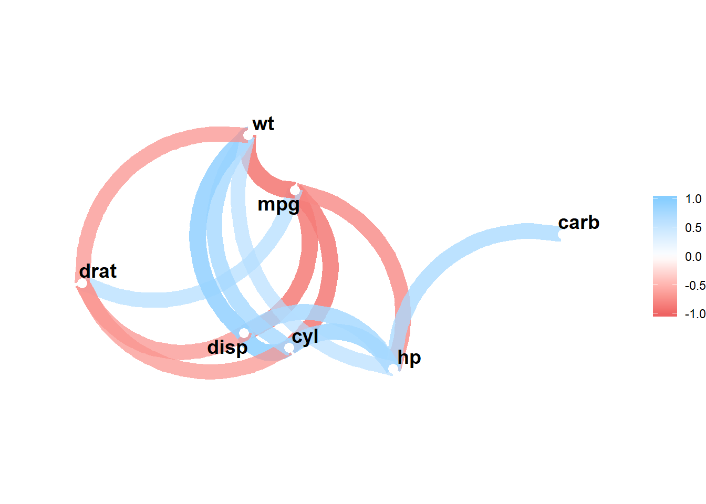

#Matriz de Correlação {#MatrizCorrelacao}


```r
require(car)
```

```
## Carregando pacotes exigidos: car
```

```
## Carregando pacotes exigidos: carData
```

```r
data(mtcars)
mtcars <- within(mtcars, {
  am <- factor(am, labels=c('Automático','Manual'))
})
mtcars <- within(mtcars, {
  vs <- factor(vs, labels=c('Não','Sim'))
})
par(bg="#fdf6e3") 

CARROS <- mtcars[, c('mpg', 'cyl', 'disp', 'hp', 'carb','drat','wt')]
```


```r
par(bg="#fdf6e3") 
library("PerformanceAnalytics")
chart.Correlation(CARROS, histogram=TRUE, pch=19)
```


```r
par(bg="#fdf6e3") 
require(magrittr)
library(corrr)
CARROS %>% correlate() %>% network_plot(min_cor=0.6)
```




```r
par(bg="#fdf6e3") 
library(psych)
pairs.panels(CARROS, scale=TRUE)
```


```r
par(bg="#fdf6e3") 
library(corrplot)
corrplot.mixed(cor(CARROS), order="hclust", tl.col="black")
```


```r
par(bg="#fdf6e3") 
library(ggcorrplot)
ggcorrplot(cor(CARROS), p.mat = cor_pmat(CARROS), hc.order=TRUE, type='lower')
```


```r
par(bg="#fdf6e3") 
library("corrgram")
corrgram(CARROS, order=TRUE,
         main="Carros",
         lower.panel=panel.shade, upper.panel=panel.pie,
         diag.panel=panel.minmax, text.panel=panel.txt)
```


```r
corrgram(CARROS, order=TRUE,
         upper.panel=panel.cor, main="Carros")
```


```r
corrgram(CARROS, order=TRUE,
         main="Carros)",
         lower.panel=corrgram::panel.ellipse,
         upper.panel=panel.bar, diag.panel=panel.minmax,
         col.regions=colorRampPalette(c("darkgoldenrod4", "burlywood1",
                                        "darkkhaki", "darkgreen")))
```


```r
par(bg="#fdf6e3") 
library(GGally)
library(ggplot2)
ggcorr(CARROS, nbreaks=8, palette='RdGy', label=TRUE, label_size=5, label_color='white')
```


```r
ggpairs(data=mtcars, # data.frame with variables
        columns=1:4, # columns to plot, default to all.
        title="Carros", # title of the plot
        colour = "am", ggplot2::aes(colour=am)) # aesthetics, ggplot2 style
```


```r
ggpairs(data=mtcars,
             columns=1:3, 
             upper = list(continuous = "density"),
             lower = list(combo = "facetdensity"),
             title="Carros",
             colour = "am", ggplot2::aes(colour=am)) 
```


