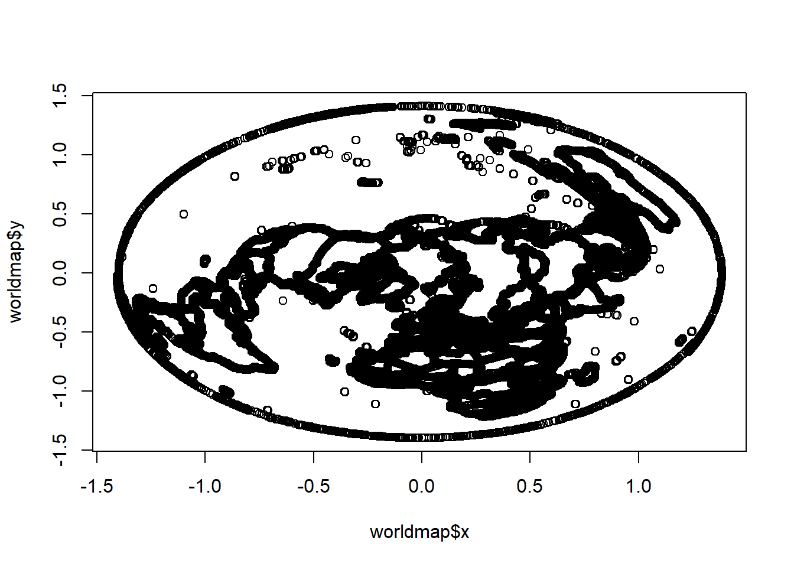

#Mapas {#Mapa}


## Mapa global


```r
# data
 library(OpenStreetMap)
library(rgdal)
```

```
## Carregando pacotes exigidos: sp
```

```
## rgdal: version: 1.3-6, (SVN revision 773)
##  Geospatial Data Abstraction Library extensions to R successfully loaded
##  Loaded GDAL runtime: GDAL 2.2.3, released 2017/11/20
##  Path to GDAL shared files: C:/Users/TPC02/Documents/R/win-library/3.5/rgdal/gdal
##  GDAL binary built with GEOS: TRUE 
##  Loaded PROJ.4 runtime: Rel. 4.9.3, 15 August 2016, [PJ_VERSION: 493]
##  Path to PROJ.4 shared files: C:/Users/TPC02/Documents/R/win-library/3.5/rgdal/proj
##  Linking to sp version: 1.3-1
```

```r
# get world map
map <- openmap(c(70,-179), c(-70,179))
plot(map)
```


```r
bingmap <- openmap(c(70,-179), c(-70,179), type = "bing")
plot(bingmap)
```


```r
 #zoom maps, plot a portion
# upperLeft, lowerRight
lat <- c(43.834526782236814, 30.334953881988564)
lon <- c(-85.8857421875, -70.0888671875)
southest <- openmap(c(lat[1],lon[1]),c(lat[2],lon[2]),zoom=7,'osm')
plot(southest) 
```


```r
require(maps)
```

```
## Carregando pacotes exigidos: maps
```

```r
worldmap <- map('world', plot = FALSE, fill = FALSE,  projection = "azequalarea")
plot(worldmap)
```


Lista de possibilidades


```r
projlist <- c("aitoff", "albers", "azequalarea", "azequidist", "bicentric",
"bonne", "conic", "cylequalarea", "cylindrical", "eisenlohr", "elliptic",
"fisheye", "gall", "gilbert", "guyou", "harrison", "hex", "homing",
"lagrange", "lambert", "laue", "lune", "mercator", "mollweide", "newyorker",
"orthographic", "perspective", "polyconic", "rectangular", "simpleconic",
"sinusoidal", "tetra", "trapezoidal")
```


```r
require(maps)
worldmap <- map('world', plot = FALSE, fill = FALSE,  projection = "tetra")
plot(worldmap)
```


