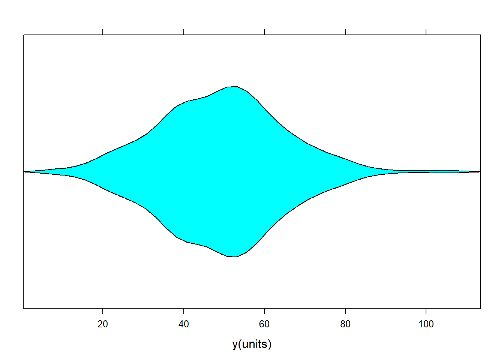
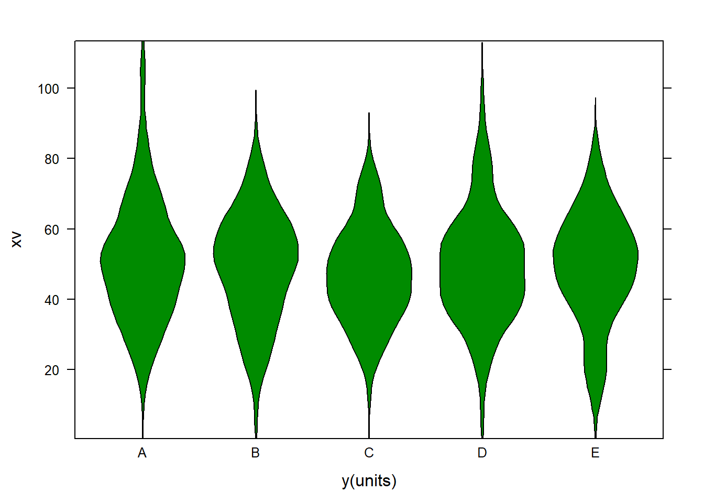
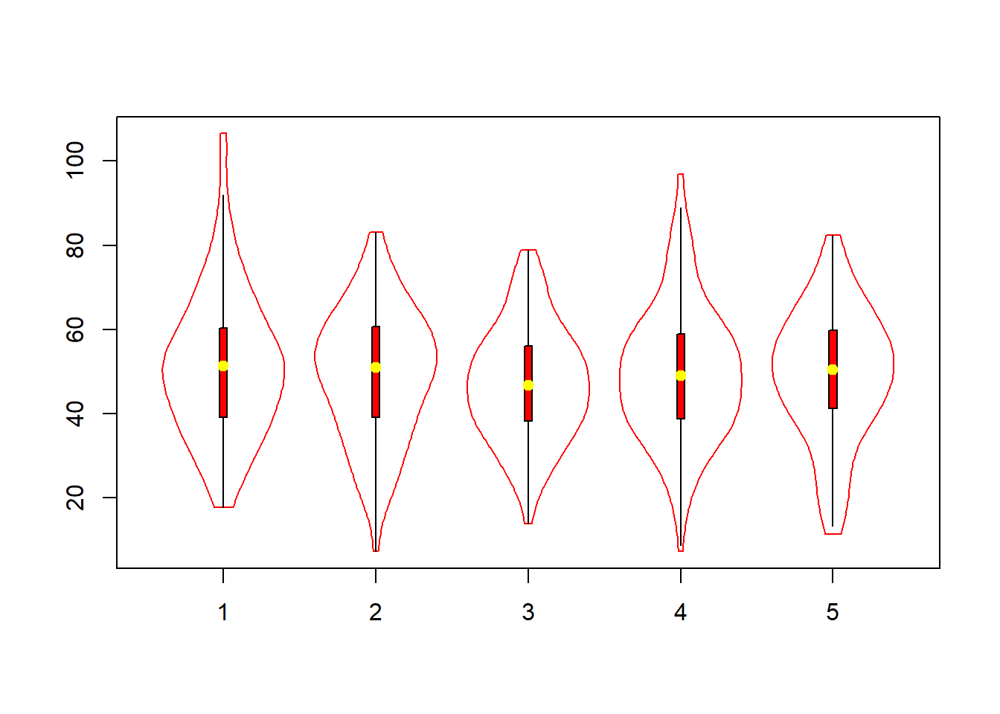
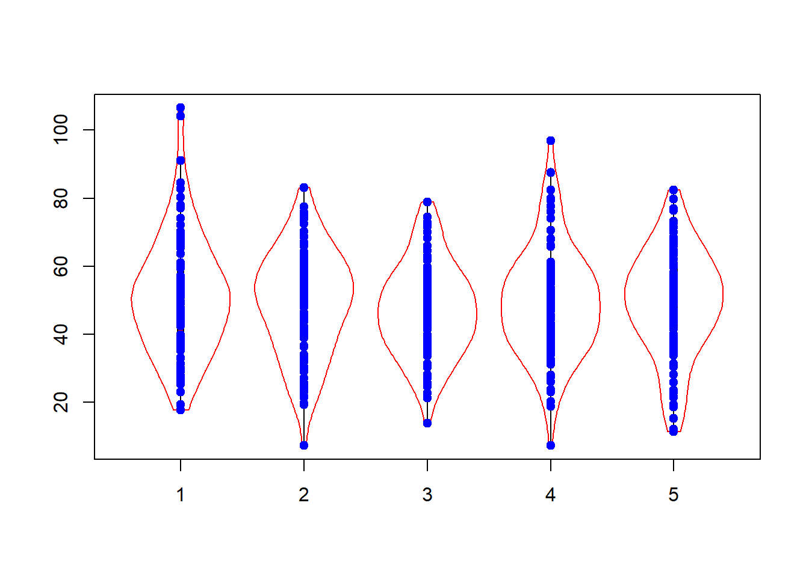

# Violino Box plot {#Violino}


```r
# data

#Violin box plot
#data
set.seed (45)
xv <- rnorm(500, 50,15)
gv <- c(rep("A",100), rep("B",100), rep("C",100), rep("D",100), rep("E", 100))
dataf <- data.frame(xv, gv)
#plot
require(lattice)
```

```
## Carregando pacotes exigidos: lattice
```

```r
library("latticeExtra")
```

```
## Carregando pacotes exigidos: RColorBrewer
```

```r
bwplot(xv, panel = panel.violin, box.ratio = 3, xlab="y(units)")
```



```r
bwplot(xv~gv, data=dataf, panel = panel.violin, box.ratio = 3, xlab="y(units)", col = "green4")
```



```r
# using vioplot 
require(vioplot)
```

```
## Carregando pacotes exigidos: vioplot
```

```
## Carregando pacotes exigidos: sm
```

```
## Package 'sm', version 2.2-5.6: type help(sm) for summary information
```

```r
vioplot(xv[1:100], xv[101:200], xv[201:300], xv[301:400], xv[401:500],col="cyan2", border="cyan2", lty=1, lwd=1, rectCol="red",
colMed="white", pchMed=19, add=FALSE, wex=1,drawRect=TRUE  )


vioplot(xv[1:100], xv[101:200], xv[201:300], xv[301:400], xv[401:500],col="white", border="red", lty=1, lwd=1, rectCol="red",
colMed="yellow", pchMed=19, add=TRUE, wex=1,drawRect=TRUE  )
```



```r
set.seed (45)
xv <- rnorm(500, 50,15)
pch1 <- rep(1:5, each = 100)


plot(1, type="n", axes=F, xlab="", ylab="")
```


```r
vioplot(xv[1:100], xv[101:200], xv[201:300], xv[301:400], xv[401:500],col="white", border="red", lty=1, lwd=1, rectCol="red",
colMed="yellow", pchMed=19, add=FALSE, wex=1,drawRect=TRUE )

points(pch1, xv, pch = 19, col = "blue") 
```



